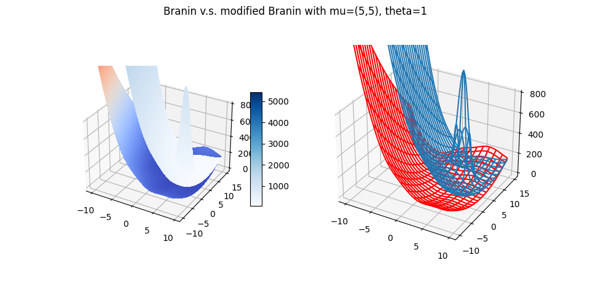

# Shape Transfer Bayesian Optimization

<p align="center"><a href="https://arxiv.org/pdf/2305.13304.pdf">[📄 Paper]</a> | <a href="https://www.aiwaves.org/recurrentgpt">[🤗 Demo - STBO]</a> |  <a href="https://www.youtube.com/watch?v=rMnw3ljCibc">[📺 Video]</a> | <a href="https://discord.gg/aNznfrYPeR">[🔥 Discord]</a> </p>
<hr>

## Introduction

If you are going to optimize hyperparameters in two similar tasks, and these two tasks have the same hyperparameters space. In task 1, you can use random/grid search, or EI (Expected Improvement) method based on GP (Gaussian Process) model to optimize the hyperparameters. In task 2, based on the optimized hyperparameters and experiment results in task 1, optimizing hyperparameters can be more efficient by transfering knowledge from task 1.

There are 2 types of transfer learning in Bayesian Optimization. The first type is the same as task 1, but initialized at the best hyperparameter selected in task 1, for example, EI method starts from best hyperparameter of task 1. The second type transfers not only knowledge of best hyperparameter, but also transfers knowledge of previous experiment results to new task (i.e., task 2).

In this project, we implement EI to optimize hyperparameters of task 1. For other methods, like grid search and rand search, since they are straight forward, so you can use them by writting several lines codes. Besides, in task 2, we implement three methods of transfer learning in Bayesian Optimizaton, EI starting from best hyperparameter of task 1, BCBO (Biases Corrected Bayesian Optimization) and STBO (Shape Transfer Bayesian Optimization) proposed in above our paper.

## Usage

To apply STBO method in real tasks, you can easily run `./main.py` script to find next point for your tasks.

### task 1:

In task 1, you can use EI method by following below steps,

* step 1: add initial experiment points

  Before start the EI method, you need to prepare some initial experiment points and get the responses by running task 1 on them. after that, add these initialization points to a file by following the header below, e.g. , `./data/experiment_points_task1_gp.tsv`.

  ```plaintext
  response#dim1#dim2#dim3
  0.4#3#4#5
  0.5#4#5#6
  ```
* step 2: run `./main.py` with `task=1`

  Let variable `task = 1` in `./main.py` script, then you can get the next experiment point for your task 1 after run `./main.py` .
* step 3: run task 1

  Get the task 1 response of new experiment point from step 2, and add the new experiment point as well as its response into file created in step 1, e.g. , `./data/experiment_points_task1_gp.tsv`.

Iteratively execute step 2 and step 3, you can do as many task 1 experiments as you can afford. At the same time, the best point (with largest response value) can be selected from task 1 experiment file, e.g. , `./data/experiment_points_task1_gp.tsv`.

### task 2:

In task 2, three optimizing hyper parameter methods have been implemented, STBO (Shape Transfer Bayesian Optimization), BCBO (Biases  Corrected Bayesian Optimization) and EI from best point. Among these three methods, EI from best point is exactly the same as EI used in task 1, only the initial points are different (EI in task 2 starts from best point selected in task 1). In addition, not only STBO and BCBO start from best point in task 1, these two methods transfer experiment  knowledge of task 1 to task 2. Specifically, STBO transfers surrogate model knowledge of task 1 to task 2, while BCBO only transfers experiment points from task 1 to task 2.

* step 1: add initial experiment points

  Although any initial experiment points can be used in task 2, it is recommended that starts from best point in task 1. Add the intial experiment points and corresponding responses into task 2 files, e.g., `./data/experiment_points_task2_STBO.tsv`, `./data/experiment_points_task2_BCBO.tsv` and `./data/experiment_points_task2_gp.tsv` . The format should be exactly the same as in task 1 file.
* step 2: run `./main.py` with `task=2`

  Let variable `task = 2` in `./main.py` script, then you can get the next experiment point for your task 2 after run `./main.py`. Note that, different method is going to give different next point for your task 2 experiment.
* step 3: run task 2

  For each next experiment point selected by these 3 methods, get the task 2 response, add the new experiment points and their responses into corresponding files created in step 1, e.g. , `./data/experiment_points_task2_STBO.tsv`, `./data/experiment_points_task2_BCBO.tsv` and `./data/experiment_points_task2_gp.tsv` .

Iteratively execute step 2 and step 3, you can run as many task 2 experiments as you can afford. Finally, the best point (with largest response value) can be selected from task 2 experiment files, which should be your optimized hyperparameters in task 2.

### less methods in task 2

In the above task 2 section, three transfer Bayesian optimization methods have been utilized. If you only want to use some of the three methods, just run task 2 on the next point selected by this method and only update the corresponding task 2 file.

## Showcases

## Simulation

We have tried **7** types of simulation experiments, which inspired us to figure out the essence of transfer learning in Bayesian Optimization. To unveil the secrets, we need to answer the following questions.

1. What should shapes of task1 1&2 be, if task 2 can be fastly optimized by transfering task 1 knowledge ?
2. What are key factors in choosing next points by tranfer learning ?

From the results of **7** types of simulation, we can have some valuable conclusions and answers for the above questions. The seven types of simulation include,

1. Exponential target functions in task 1&2 ,
2. Branin function in task 1 v.s. modified Branin function in task 2 ,
3. Needle function and its shifted version in task 1&2 respecively ,
4. Mono modal function in task1, and Needle function in task 2 ,
5. 

The first type takes exponential functions as target functions in task 1 and 2. The second type takes Branin function as target function of task 1, and modified Branin function as target function of task 2. The third type uses needle function and its shifted version as target functions of task 1 and 2 respectively.

### type 1:

$$
f_1(x) = \exp\{-\frac{1}{2\theta^2}\|x-\mu_1\|^2\}
$$

$$
f_2(x) = \exp\{-\frac{1}{2\theta^2}\|x-\mu_2\|^2\}
$$

The following 3D picture illustrates the two task functions where $\theta=1 $, $\mu_1=(0, 0)$ and $\mu_2=(1, 1)$ .

<div align=center>

</div>

#### configuration

To run the type 1 simulation, you can change the simualtion 1 configuration given in ``run_simulation.sh`` script.

```bash
Thetas="1"  
mu_1="0_0"
mu_2="2_2"

T1=20          # number of experiment points in task1 
T2=20          # number of experiment points in task2

num_rep=20     # repetition times 
```

Where Thetas is the list of $\theta$ values seprated by space, `mu_1` and `mu_2` are the $\mu_1$ and $\mu_2$ vectors whose components are separated by underline _ .

### type 2:

Let $x=(x_1, x_2)\in\mathbb{R}^2$,

$$
\begin{align}
   f_1(x) &= \big(x_2 - \frac{5.1}{4\pi^2}x_1^2 + \frac{5}{\pi}x_1 - 6\big)^2 + 10\times(1 - \frac{1}{8\pi})\cos(x_1) + 10  \\
  f_2(x) &= f_1(x) + 20x_1\cdot\sin(x_2)
\end{align}
$$

Below 3D picture depicts the Branin function.

<div align=center>

</div>

#### configuration

To run type 2 simulation, you should change the simulation 2 configuration in `run_simulation.sh` like below,

```bash
T1=20          # number of experiment points in task1
T2=20          # number of experiment points in task2

num_rep=20     # repetition times
```

### type 3:

$$
\begin{align}
f_1(x) &= 
    \begin{cases}{lr}
       0.5\exp(x), & \text{if ~~~}  x\leq 2   \\
       -100\times(x-2.25)^2 + 6.25 + 0.5\exp(2), & \text{if~~~ } 2\leq x \leq 2.5 \\
       \sin(2x)+ 2\log(x) + 0.5\exp(2) - 2\log(2.5) - \sin5, & \text{if ~~~}  2.5\leq x \leq 5 \\
       \exp(-x + 5) - 1 + f_1(5), & \text{if  ~~~} x > 5
    \end{cases}  \\ \\
f_2(x, s) &= f_1(x - s) 
\end{align}
$$

The following picture shows the needle function, $f_1$, in color blue, and the shifted needle function ($s=0.1$), $f_2$, in color orange. Besides, the difference between $f_1$ and $f_2$ , $f_2 - f_1$,  is shown in color green.

<div align=center>

</div>

#### configuration

To run the type 3 simulation, you should change the simulation 3 configuration given in ``run_simulation.sh`` script.

```bash
shift_task2="0.1"
T1=40          # number of experiment points in task1 
T2=20          # number of experiment points in task2

num_rep=20
```

Where  shift_task2 is the value list of $s$ in task2 function $f_2(x, s)$.

### run simulation

Then, run script `run_simulation.sh` with 3 parameters (stage, from_task1, task2_start_from) as follows,

```bash
./run_simulation.sh  <stage-number>   <start_from_task1>   <task2_start_from>
```

where all three types of simulations will be executed if `stage-number` is 0, only exponential simulation will be executed if `stage-number` is 1, only Branin simulation will be executed if `stage-number` is 2, and only needle type of simulation will be run if `stage-number` is 3 .

When the task1 experiments have been done,  task 1 result files can be found in `./data` dir. If you want to skip task1 experiments, please set `start_from_task1` to 0. Otherwise, simulation starts from scratch and generates task 1 experiment results.

In task1, EI and random search have been applied. Therefore, you can start task2 experiments based on EI or random search results in task1. If `task2_start_from` is `gp`, then task2 starts from EI ( based on Gaussian process) results in task1; if `task2_start_from` is `rand`, then task2 starts from random search results in task1. e.g.

```shell
./run_simulation.sh  1   1   rand
```

the above command executes to run exponential simulation in task1, and run task2 based on task 1 random search results.

### analyze results

After simulation jobs are finished, both task1 and 2 results can be found in `EXP_mu2_x_x_theta_x` subdir dir under `./data` , e.g. `./data/EXP_mu2_1.0_1.0_theta_0.5` . In this dir, `num_rep` subdirs can be found and each subdir contains simulations results. To analyze these simulation results, `./analyze_results.py` tool generate some plots.

```powershell
python3 ./analyze_results.py  <input_dir>  <out_dir>  <topic>
```

where `input_dir` is the output dir after run simulation, `out_dir` is the analyzing output dir, and topic decides what files to analyze, possible candidates (`task1`, `from_cold`, `from_gp`, `from_rand`).

* #### visualize task 1 results

  The following command is running to analyze task 1 results,


  ```
  python3 ./analyze_results.py  ./data/EXP_mu2_0.1_0.1_theta_0.5 ./simulation_results/EXP_theta_0.5 task1 
  ```

  Two images `EXP_mu2_0.1_0.1_theta_0.5_task1_mean.png` and `EXP_mu2_0.1_0.1_theta_0.5_task1_medium.png` can be found in the output dir, `./simulation_results/EXP_theta_0.5` . The following image is `EXP_mu2_0.1_0.1_theta_0.5_task1_medium.png` , which shows the results of rand search and EI (gp) in task 1.

<div align=center>

</div>

* #### visualize task 2 results

  The following command is running to analyze task 2 results for comparision between transfer and non-transfer methods, i.e., gp (EI from cold start) and STBO (from random search results in task 1).


  ```
  python3 ./analyze_results.py  ./data/EXP_mu2_0.1_0.1_theta_0.5 ./simulation_results/EXP_theta_0.5 from_cold
  ```

  Two images, `EXP_mu2_0.1_0.1_theta_0.5_from_cold_mean.png` & `EXP_mu2_0.1_0.1_theta_0.5_from_cold_medium.png` , can be found in the output dir, `./simulation_results/EXP_theta_0.5/`. The following image is `EXP_mu2_0.1_0.1_theta_0.5_from_cold_medium.png`, which shows the comparison between transfer learning and non-transfer learning in Bayesian optimization. In this image, stbo method optimizes task 2 by transfering task1 knowledge of rand search, while EI (gp) method is exactly the same as in task 1 without any knowledge from task1.

  <div align=center>
  
  </div>

  The following commands are running to analyze task 2 results starting from random search and EI results of task1 respectively,

  ```
  python3 ./analyze_results.py  ./data/EXP_mu2_0.1_0.1_theta_0.5 ./simulation_results/EXP_theta_0.5 from_rand
  python3 ./analyze_results.py  ./data/EXP_mu2_0.1_0.1_theta_0.5 ./simulation_results/EXP_theta_0.5 from_gp
  ```

  Then you can find the following 4 images in output dir, `./simulation_results/EXP_theta_0.5/`,

  1. `EXP_mu2_0.1_0.1_theta_0.5_from_rand_mean.png`  &  `EXP_mu2_0.1_0.1_theta_0.5_from_rand_medium.png`
  2. `EXP_mu2_0.1_0.1_theta_0.5_from_gp_mean.png`  &  `EXP_mu2_0.1_0.1_theta_0.5_from_gp_medium.png`

<div align=center>
  
</div>

## Citation

```angular2
@misc{2024stbo,
      title={Shape Transfer Bayesian Optimization}, 
      author={Yang Li, Daijun Chen, Shifeng Xiong, Yuanzhi Zhao},
      year={2024},
      eprint={},
      archivePrefix={arXiv},
      primaryClass={cs.CL}
}

@InProceedings{2017bcbo,
  title = 	 {Regret Bounds for Transfer Learning in Bayesian Optimisation},
  author = 	 {Shilton, Alistair and Gupta, Sunil and Rana, Santu and Venkatesh, Svetha},
  booktitle = 	 {Proceedings of the 20th International Conference on Artificial Intelligence and Statistics},
  pages = 	 {307--315},
  year = 	 {2017},
  editor = 	 {Singh, Aarti and Zhu, Jerry},
  volume = 	 {54},
  series = 	 {Proceedings of Machine Learning Research},
  month = 	 {20--22 Apr},
  publisher =    {PMLR},
  pdf = 	 {http://proceedings.mlr.press/v54/shilton17a/shilton17a.pdf},
  url = 	 {https://proceedings.mlr.press/v54/shilton17a.html},
}

@Inproceedings{wilson2018maximizing,
  title     = {Maximizing acquisition functions for Bayesian optimization},
  author    = {Wilson, James and Hutter, Frank and Deisenroth, Marc},
  booktitle = {Advances in neural information processing systems},
  year      = {2018},
  volume    = {31}
}

```
